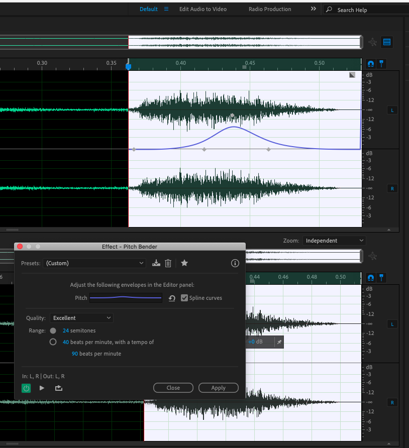

Here's what I tried:

## UINavigate
[UINavigate_nharsch-changes.wav](sound_assets/UINavigate_nharsch-changes.wav)

- cut intro and outro silences
- created intro and outro fades
- slowed by 111% (locked pitch and duration)
- created a pitch bend curve on the end to accent the page turn
  - 
- normalized to -5 db

## UIEquip

[UIEquip_nharsch-changes.wav](sound_assets/UIEquip_nharsch-changes.wav)

- cut intro and outro silence
- EQ
    - slight bost around 200hz
    - slight boost around 2k
- normalize to -5db
